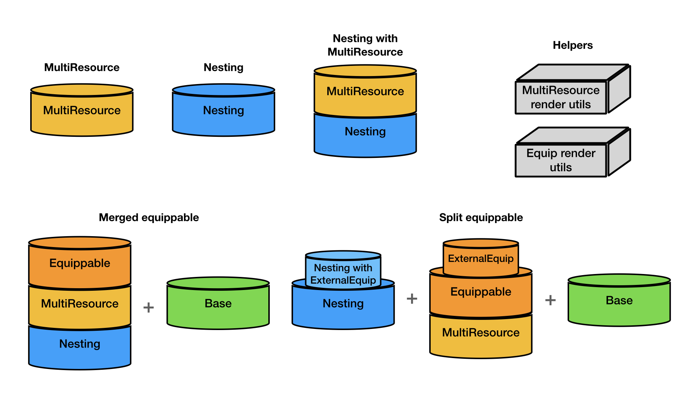

# RMRK Solidity

A set of Solidity sample contracts using the RMRK standard implementation on EVM.

## RMRK Legos

RMRK is a set of NFT standards which compose several "NFT 2.0 lego" primitives. Putting these legos together allows a
user to create NFT systems of arbitrary complexity.

There are various possibilities on how to combine these legos, all of which are ERC721 compatible:

1. Multiresource
    - Only uses the Multiresource RMRK lego
2. Nesting
    - Only uses the Nesting RMRK lego
3. Nesting with Multiresource
    - Uses both Nesting and Multiresource RMRK legos
4. Equippable Multiresource with Nesting and Base
    - Merged equippable is a more compact RMRK lego composite that uses less smart contracts, but has less space for
    custom logic implementation
    - Split equippable is a more customizable RMRK lego composite that uses more smart contracts, but has more space for
    custom logic implementation

The first 3 use cases have stand alone versions with both minimal and ready to use implementations. The latter two, due
to Solidity contract size constraints, Multiresource and Equippable logic are included in a simgle smart contract, while
Nesting and ownership are handled by either the same smart contract or a separate one. Base is also a separate smart
contract for practical reasons, since one Base can be used by multiple tokens.




## Installation

You can start using the RMRK EVM implementation smart contracts by installing the dependency to your project:

```
npm install @rmrk-team/evm-contracts
```

Once you have installed the `@rmrk-team/evm-contracts` dependency, you can refer to one of the samples residing in this
repository's [`contracts/`](./contracts/README.md) directory. The versions starting with `Simple` keyword are ready to
use; you can simply extend those for your own contracts and pass fixed or variable parameters to the constructor. The
examples starting with `Advanced` keyword showcase the implementation where you have more freedom in implementing custom
business logic. The available internal functions when building it are outlined within the examples.

For each of the lego combinations we have sample versions:

1. [`Multiresource`](./contracts/MultiResource/README.md)
2. [`Nesting`](./contracts/Nesting/README.md)
3. [`Nesting with Multiresource`](./contracts/NestingMultiResource/README.md)
4. [`MergedEquippable`](./contracts/MergedEquippable/README.md)
5. [`SplitEquippable`](./contracts/SplitEquippable/README.md)

Additionally we have render util contracts. The reason these are separate is to save contract space. You can have a single deploy of those and use them on every contract or even use the exising ones (We'll provide them in the future):

1. [`MultiResource render utils`](@rmrk-team/evm-contracts/contracts/RMRK/utils/RMRKMultiResourceRenderUtils.sol)
provides utilities to get resource objects from IDs, and accepted or pending resource objects for a given token. The
MultiResource lego provides only IDs for the latter.
2. [`Equip render utils`](@rmrk-team/evm-contracts/contracts/RMRK/utils/RMRKEquipRenderUtils.sol) provides the same
shorcuts on extended resources (with equip information). This utility smart contract also has views to get information
about what is currently equipped to a token and to compose equippables for a token resource.