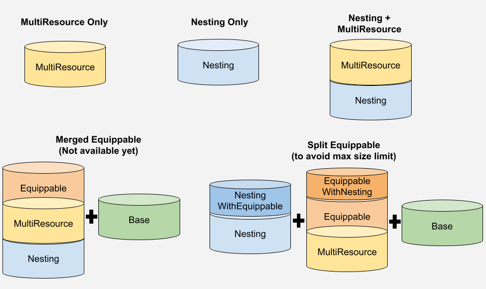

# RMRK Solidity

A set of Solidity sample contracts for the RMRK standard implementation on EVM.

# Legos
There are a variety of ways to use these implementations, all ERC721 compatible:
1. Multiresource Only
1. Nesting Only
1. Nesting + Multiresource
1. Nesting + Multiresource + Equippable (+Base) 

The first 3 use cases have stand alone versions with both minimal and ready to use implementations. 
For the latter, due to Solidity contract size limits, nesting and ownership are handled by one contract, and multiresource + equippable logic in another one. Base is also a separate contract for practical reasons, since it can be used by many tokens. We are working on a merged version which includes the minimum viable functionality in a single contract.




## Installation

You can start directly using the contracts by installing the repo:
```
$ npm install @rmrk-team/evm-contracts
```

Then simply follow one of the samples under contracts. The versions starting with Simple are ready to use, you can simply extend those for your own contracts and pass fixed or as argument parameters to the constructor. 
// TODO: Expand on what they have included.

For each of the lego combinations we have a sample Simple version.
1. [Multiresource Only](https://github.com/rmrk-team/evm-sample-contracts/blob/master/contracts/SimpleMultiResource.sol)
1. [Nesting Only](https://github.com/rmrk-team/evm-sample-contracts/blob/master/contracts/SimpleNesting.sol)
1. [Nesting + Multiresource](https://github.com/rmrk-team/evm-sample-contracts/blob/master/contracts/SimpleNestingMultiResource.sol)
1. [Equippable(Merged)](https://github.com/rmrk-team/evm-sample-contracts/blob/master/contracts/SimpleEquippable.sol) + [Base](https://github.com/rmrk-team/evm-sample-contracts/blob/master/contracts/SimpleBase.sol)
1. [Nesting(ExternalEquip)](https://github.com/rmrk-team/evm-sample-contracts/blob/master/contracts/SimpleNestingExternalEquip.sol) + [Multiresource + Equippable(External)](https://github.com/rmrk-team/evm-sample-contracts/blob/master/contracts/SimpleExternalEquip.sol) + [Base](https://github.com/rmrk-team/evm-sample-contracts/blob/master/contracts/SimpleBase.sol). If you don't need much custom logic, you will probably want to use the Merged version.

For each of the lego combinations we have a sample Advanced version. It includes comments on the expected functionality to be implemented, and the internal functions available to do so. In this case, there's a merged version for equippable, but it will likely exceed the size limitation when fully implemented.
1. [Multiresource Only](https://github.com/rmrk-team/evm-sample-contracts/blob/master/contracts/AdvancedMultiResource.sol)
1. [Nesting Only](https://github.com/rmrk-team/evm-sample-contracts/blob/master/contracts/AdvancedNesting.sol)
1. [Nesting + Multiresource](https://github.com/rmrk-team/evm-sample-contracts/blob/master/contracts/AdvancedNestingMultiResource.sol)
1. [Equippable(Merged)](https://github.com/rmrk-team/evm-sample-contracts/blob/master/contracts/AdvancedEquippable.sol) + [Base](https://github.com/rmrk-team/evm-sample-contracts/blob/master/contracts/AdvancedBase.sol)
1. [Nesting(ExternalEquip)](https://github.com/rmrk-team/evm-sample-contracts/blob/master/contracts/AdvancedNestingExternalEquip.sol) + [Multiresource + Equippable(External)](https://github.com/rmrk-team/evm-sample-contracts/blob/master/contracts/AdvancedExternalEquip.sol) + [Base](https://github.com/rmrk-team/evm-sample-contracts/blob/master/contracts/AdvancedBase.sol)

Additionally we have render util contracts. The reason these are separate is to save contract space. You can have a single deploy of those and use them on every contract or use exising ones (We'll provide them in the future).
1. @rmrk-team/evm-contracts/contracts/RMRK/utils/RMRKMultiResourceRenderUtils.sol for shorcuts to get resource objects from Ids, and accepted or pending resource objects for a given token. The MR lego provides only Ids for the latter.
1. @rmrk-team/evm-contracts/contracts/RMRK/utils/RMRKEquipRenderUtils.sol for the same shorcuts on extended resources (with equip information). This contract also has the views to get what a token has equipped and to compose equippables for a token-resource.
